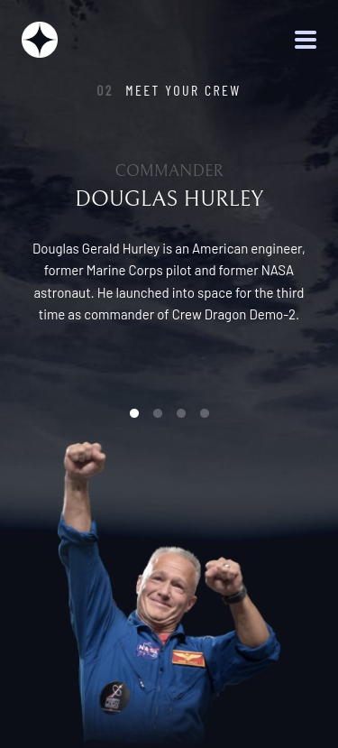

# Frontend Mentor - Space tourism website solution

## Table of contents

- [Overview](#overview)
  - [The challenge](#the-challenge)
  - [Screenshot](#screenshot)
  - [Links](#links)
- [My process](#my-process)
  - [Built with](#built-with)
  - [What I learned](#what-i-learned)
  - [Continued development](#continued-development)
  - [Useful resources](#useful-resources)
- [Author](#author)
- [Acknowledgments](#acknowledgments)

 ## ✨ Features

- **Responsive design**: mobile, tablet, and desktop using Tailwind CSS.
- **Interactive mobile menu** with open/close animation.
- **Dynamic content change** (destinations, crew, and technology) loaded from a JSON file.  
- **Improved accessibility**:
  - Use of `aria-selected` in tabs.
- Semantic tags (`<header>`, `<nav>`, `<main>`...).  
- **Animated transitions** on underlines and buttons.
- **Support for optimized images** (`.webp` + `.png` fallback).

### The challenge

Users should be able to:

- View the optimal layout for each of the website's pages depending on their device's screen size
- See hover states for all interactive elements on the page
- View each page and be able to toggle between the tabs to see new information

### Screenshot

### Links

- Solution URL: [Add solution URL here](https://your-solution-url.com)
- Live Site URL: [Add live site URL here](https://your-live-site-url.com)

## My process

### Built with

- Semantic HTML5 markup
- CSS custom properties
- Flexbox
- CSS Grid
- TAILWINDCSS
- Vanilla Javascript
- Mobile-first workflow

## Author

- Website - [Add your name here](https://www.your-site.com)
- Frontend Mentor - [@yourusername](https://www.frontendmentor.io/profile/yourusername)
